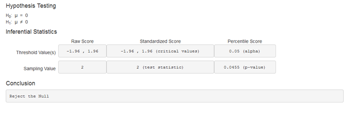

## What does the App do?

1. The application conducts a hypothesis test on the mean given some inputs.
2. Shows an interactive graph of the sampling distribution with the rejection region in red.
3. Lists important statistics like the critical values, p-values, etc...
4. Gives a conclusion on whether one should reject or not reject.

## Why is this App useful?
1. Hypothesis testing can be complicated and easy to make mistakes.
2. Much quicker than conducting the test from scratch.
3. Excellent tool for new learners of statistics to better understand the concept.

--- .class #id 

## The User Interface


<table><tr>
        <td></td>

<td>The user interface has:

<ul>
<li>4 regular text inputs (although they take numbers)</li>
<li>2 sets of radio buttons</li>
<li>1 numeric input</li>
</ul>
</td>

</tr></table>


---
## Sampling Distribution Graph


This graph is fairly tricky as it is entirely reactive to the inputs.  Below is the code used to initially generate the graph when a population standard deviation is used. To give the graph its color, polygons were used but this code is omitted.

```{r, eval=FALSE}
#Creating the plot#
curve(dnorm(x,mu,SE),xlim=c(boundl,boundu),
      main='Normal Density',
      ylab="",yaxt="n",
      xlab="Sample Mean")
```

---
## Hypothesis Test
The final part of the application is the test itself.



The application gives all the useful statistics along with a conclusion.


